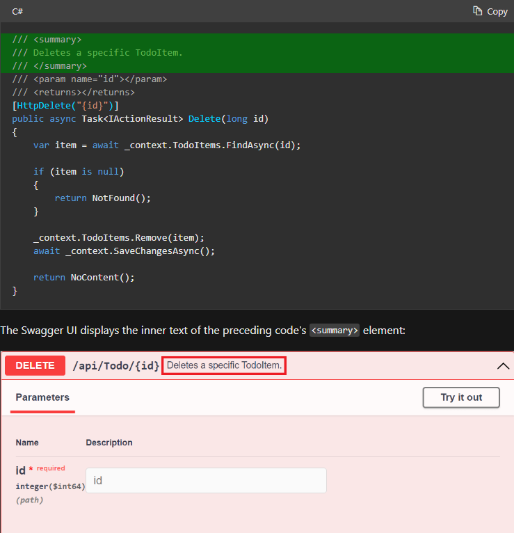

# Analyzátory, .editorconfig a další nastavení které používáme

V posledních letech přibylo v .netu nespočetné množství analyzátorů a
nastavení se kterými není jednoduché udržet krok. V následujících
odstavcích se proto pokusím představit nastavení které používáme na 
našich projektech.

Společně s popisem analyzátorů popíšene i další části našeho projektu
které používáme jako defaultní.

## Show me the code

TODO odkaz

## .editorConfig a Directory.Build.props

Analyzátory budeme přidávat v souboru `Directory.Build.props` a nastavovat v editorConfigu.
`Directory.Build.props` je soubor který po přidání do rootu solution nsatavuje všechny .csproj
soubory v solution. Formát tohoto souboru je stejný jako formát csproje a funguje tak že se
jeho obsah rozkopíruje do všech .csproj souborů v soulution. Je to tedy ideální místo pro
obecná nastavení - například analyzátory.

EditorConfig je obecně používán pro nastavení stylů v solution. V .netu se ale také
používá pro nastavení analyztorů.

TLDR:

* .editorconfig - nastavení formátování a analyzátorů
* Directory.Build.props - je společné nastavení všech csproj projektů v solution. Tento soubor je prakticky zkopírován do každého .csproj souboru který v solution existuje

## Directory.Build.props

První část našeho `Directory.Build.props` obsahuje obecné nastavení csprojů:

```xml
<PropertyGroup>
    <TargetFramework>net6.0</TargetFramework>
    <LangVersion>10</LangVersion>
    <Nullable>enable</Nullable>
    <TreatWarningsAsErrors>True</TreatWarningsAsErrors>
    <WarningsNotAsErrors>CS0618</WarningsNotAsErrors>
    <NoWarn>CA1014,CS1591</NoWarn>
    <EnableNETAnalyzers>true</EnableNETAnalyzers>
    <AnalysisMode>All</AnalysisMode>
    <EnforceCodeStyleInBuild>true</EnforceCodeStyleInBuild>
    <!--    https://www.meziantou.net/csharp-compiler-strict-mode.htm    -->
    <Features>strict</Features>
    <IncludeOpenAPIAnalyzers>true</IncludeOpenAPIAnalyzers>
    <ImplicitUsings>enable</ImplicitUsings>
    <!--    Anylezrs needs this to analyse documentation comments-->
    <GenerateDocumentationFile>true</GenerateDocumentationFile>
</PropertyGroup>
```
### TargetFramework 
Určí jaká verze frameworku se má používat. Díky tomu, že je verze určena přímo v `Directory.Build.props` zajistíme jednodušší update na novou verzi .netu

### LangVersion 
Tento parameter je nepovinný ale velice užitečný. Pokud máte na svém počítači nainstalovaných více verzí .netu tak compilátor 
automaticky předpokládá že používáte tu nejnovější a nabízí vám nejnovější C# featury (nehledně na to jak nastavíte TargetFramework). 

Pokud jste ale ještě nezmigrovali váš projekt na nejnovější verzi C# tak se vám může stát že lokálně použijete nové funkce 
.netu a vše se bude tvářit normálně funkčně. Když ale pushnete vaše změny tak vám build server může oznámit že 
nové funkce nepodporuje protože nemá nainstalované nejnovější .net. Abychom těmto zbytečným chybám předešli tak vždy tento flag nastavujeme na
správnou verzi C#.


### \<Nullable>enable\</Nullable> 
Spustí kontrolu nullability u referenčních typů. NullReference exceptions jsou jedny z nejhorších vyjímek na které můžete
narazit a tento flag umožní nalezení většiny těchto chyb už za buildu. Více o nullable reference types [zde](https://thecodeblogger.com/2022/05/26/getting-started-on-nullable-reference-types/)


### \<TreatWarningsAsErrors>True\</TreatWarningsAsErrors> 

Zajistí že všechny warningy se zobrazí jako errory.  Warningy často obsahují důležité informace které je potřeba řešit. Z toho důvodu je vhodné programátory
donutit aby se jimy zabývali.

V některých případech jsou ale warningy false positive nebo z jiného důvodu neplatné. V těchto případech máme několik možností jak specifický warning
potlačit.


#### Potlačení pomocí attributu

Nejčastějším způsobem potlačení warningu (erroru v případě enablování `TreatWarningsAsErrors`) je attribut [SuppressMessage].

Příklad:

```csharp
[SuppressMessage("Mark enums with FlagsAttribute", "CA1027", Justification = "This is not flags enum")]
public enum TestEnum
{
    Unknown = 0,
    Value1 = 1,
    Value2 = 2,
    Value3 = 4,
}
```

#### Potlačení pomocí pragma

V některých případech není možné použít `SuppressMessage` attribut. V těchto případech je potřeba použít #pragma.

Příklad:

```csharp
#pragma warning disable CS8618
    private Class()
    {
    }
#pragma warning restore CS8618
```


#### Potlačení csprojem

Pokud chceme vypnout warning pro celý projekt tak můžeme do csproje (nebo do Directory.Build.props) přidat
`<NoWarn>errorCode</NoWarn>`.

Pokud chceme některý z errorů změnit zpět na warning tak můžeme použít
`<WarningsNotAsErrors>errorCode</WarningsNotAsErrors>`.

#### Potlačení editor configem

Další možností jak error potlačit globálně je pomocí editorconfigu. Do editorconfigu můžeme přidat `dotnet_diagnostic.errorCode.severity = none`
a tím error vypneme pro celou solution.

Některé warningy není možné potlačit editor configem a jdou potlačit pouze v csproji. Příkladem takového warningu je CA1014.

### \<WarningsNotAsErrors>CS0618\</WarningsNotAsErrors>

Warning CS0618 informuje programátora že použil obsolete metodu, propertu, třídu a další. Těmto situacím
se často nemůžeme vyvarovat ale je dobré o nich vědět. Je to tedy jedna z mála chyb kterou je vhodné nastavit jako 
warning.

### \<NoWarn>CA1014,CS1591\</NoWarn>

CA1014 je warning který je vhodný pouze pokud náš kód budeme volat z jiných programovacích jazyků. V našich projektech něco takového 
nikdy neděláme a proto tento warning vypínáme globálně.

CS1591 nás nutí okomentovat všechny public věci v našem kódu. Obvykle náš kód píšeme tak aby nebylo nutné přidávat komentáře a proto
tento warning také vypínámé. Ovšem pokud píšete například nuget knihovnu tak je tento flag velice užitečný.

### \<EnableNETAnalyzers>true\</EnableNETAnalyzers>

V dřívějších verzích .Net nabízel microsoft package s názvem FxCop. FxCop přidával do projektu mnoho užitečných analyzátorů.
Tyto analyzátory byly tak užitečné že se je microsoft rozhodl integrovat přímo do .Netu a od verze 5 tedy můžeme
přidat flag `EnableNETAnalyzers` který spustí FxCop analyzátory. [Zde](https://learn.microsoft.com/en-us/dotnet/fundamentals/code-analysis/overview) 
je příklad některých warningů které budou zapnuty.

### \<AnalysisMode>All\</AnalysisMode>

Abychom spustili všechny analyzátory které flag `EnableNETAnalyzers` přidává tak musíme ještě specifikovat že chceme analyzátory všech kategorií.
To zajistíme pomocí ``<AnalysisMode>All</AnalysisMode>``.

``<AnalysisMode>All</AnalysisMode>`` v některých případech nespustí všechny analyzátory a je potřeba explicitní spuštění ještě v .editorconfigu.
Jak spustit analyzátory v editorconfigu se dočtete dále (TODO odkaz).


### \<EnforceCodeStyleInBuild>true\</EnforceCodeStyleInBuild>

``EnforceCodeStyleInBuild`` přidá další analyzátory které kontrolují code style podle toho jak nastavíte editor config. 
Seznam errorů můžete najít [zde](https://github.com/dotnet/roslyn/blob/main/src/Analyzers/Core/Analyzers/EnforceOnBuildValues.cs).

### \<Features>strict\</Features>
Features strict spustí další analyzátory. Popis [zde](https://www.meziantou.net/csharp-compiler-strict-mode.htm).

###  \<IncludeOpenAPIAnalyzers>true\</IncludeOpenAPIAnalyzers>

Pokud implementujete REST API tak jako my tak by se vám mohl hodit open api analyzátor.
Hlavní výhodou tohoto analyzátoru je že vás nutí specifikovat pomocí attributů jaké HTTP response
vaše endpointy vrací. Specifikací HTTP responsů umožníte swaggeru použít tuto informaci a zobrazit ji v UI.

Více o tomto analyzátoru [zde](https://learn.microsoft.com/en-us/aspnet/core/web-api/advanced/analyzers?view=aspnetcore-6.0).

###  \<ImplicitUsings>enable\</ImplicitUsings>

ImplicitUsings přidá do všech souborů v projektu často používané usingy. 
Výčet přidaných usingů můžete najít [zde](https://dotnetcoretutorials.com/2021/08/31/implicit-using-statements-in-net-6/).


### \<GenerateDocumentationFile>true\</GenerateDocumentationFile>

GenerateDocumentationFile vytvoří XML soubory z vašich dokumentačních komentářu a přidá je do vybuilděných souborů.
Analyzátory pak mohou kontrolovat tyto soubory a doporučit úpravy.

Dalším využitím tohoto flagu je zobrazení dokumentačních komentářů ve swagger:  




Více informací [zde](https://learn.microsoft.com/en-us/aspnet/core/tutorials/getting-started-with-swashbuckle?view=aspnetcore-6.0&tabs=visual-studio#api-info-and-description).

## Directory.build.props 2. část

```xml
<ItemGroup>
    <PackageReference Include="StyleCop.Analyzers" Version="1.2.0-beta.354">
        <PrivateAssets>all</PrivateAssets>
        <IncludeAssets>runtime; build; native; contentfiles; analyzers</IncludeAssets>
    </PackageReference>
    <PackageReference Include="JetBrains.Annotations" Version="2022.1.0"/>
</ItemGroup>
<ItemGroup>
<InternalsVisibleTo Include="Tests"/>
</ItemGroup>
```

### StyleCop.Analyzers

StyleCop je package který obsahuje analyzátory kontrolující styl kódu. Obvykle jsou
to stylystické věci na které .editorconfig už nestačí. Například počet povolených řádků mezi metodami, 
zarovnání závorek u prázdné metody a mnoho dalších. Úplný výčet warningů můžete najít 
[zde](https://github.com/DotNetAnalyzers/StyleCopAnalyzers/blob/master/DOCUMENTATION.md).

Beta verzi je nutné použít protože starší verze nepodporují nové C# features.

### JetBrains.Annotations

Pokud používáte JetBrains Rider nebo Resharper tak se vám bude hodit pakcage JetBrains.Annotations.
JetBrains.Annotations obsahuje atributy které pomáhají vašemu IDE nabízet lepší analýzu kódu. JetBrains.Annotations obsahuje
velké množství atributů ale jedněmi z nejzajímavější jsou `[MustUseReturnValueAttribute]` a `[UsedImplicitly]`.

`[MustUseReturnValueAttribute]` značí, že návratová hodnota metody musí být použita. 
Pokud není použita tak IDE zobrazí error. Více [zde](https://www.jetbrains.com/help/resharper/Reference__Code_Annotation_Attributes.html#MustUseReturnValueAttribute).

`[UsedImplicitly]` značí, že třída, metoda nebo něco jiného není přímo referencováno v kódu ale je
použité nepřímo. Obvykle pomocí reflexe. Věc označená tímto atributem se pak v IDE zobrazí jako použitá. 
Více [zde](https://www.jetbrains.com/help/resharper/Reference__Code_Annotation_Attributes.html#UsedImplicitlyAttribute).

### \<InternalsVisibleTo Include="Tests"/\>

[InternalsVisibleTo](https://www.meziantou.net/declaring-internalsvisibleto-in-the-csproj.htm) 
je nastavení které umožní assembly vidět na internal věci v jiné assembly.
Nastavením `InternalsVisibleTo` přímo v Directory.Build.props umožníme testům vidět na všechny internal věci 
ve všech assembly.


## .editorconfig
 
Popisovat celý editorconfig nemá význam a proto se zaměřím jen na nejdůležitější části.
Celý editorconfig pak můžete najít zde (TODO odkaz).

Editor config je rozdělen do 3 částí - formátování, naming a analyzátory.
Formátování a naming je poměrně standartní ale velice striktně nastavené.

Sekce analyzátorů vypíná (nebo nastavuje na suggestion) některé kontroly které není
vhodné vynucovat jako error. Pokud se rozhodnete použít naše nastavení
tak je pro vás důležité zkontrolovat potlačení která jsou okomentována jako "!!IMPORTANT!!".
Warningy označená tímto textem se mohou na vašem projektu hodit ale v našem případě jsou nevhodná.

### Spuštění všech kategorii analyzátorů

Na konci našeho editorconfigu jsou nastavení která spustí všechny kategorie NetAnalyzátorů.
Tyto pravidla mají formát: `dotnet_analyzer_diagnostic.category-XXXX.severity = error`.
Pokud se tedy rozhodnete spustit NetAnalyzátory (TODO odkaz) tak je vhodné tuto část vykopírovat do
vašeho editor configu.
