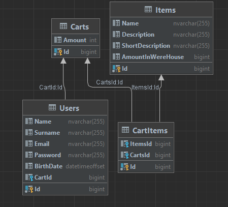

# Rychlost testů které používají SQL databázi

Co se dozvíte:

* Jsou testy používající databázi opravdu pomalé? Jak dlouho běží například stovky testů?
* Jak optimalizovat testy používající SQL databázi?
* Proč jsou integrační testy používající databázi pomalé? (překvapivě to není pouze voláním databáze)

## Problém s měřením performance v .Netu

Při prvním spuštění vašeho kódu .NET provádí velké množství drahých operací jako je jitting, načítání
knihoven, volání statických konstruktorů a další. Všechny tyto operace jsou poměrně náročné
a mají velice odlišnou performance než další spuštění kódu. Z tohoto důvodu se obvykle při měření
performance první vzorky zahazují a až následně se měří rychlost.

Při zkoumání rychlosti testů nás zajímájí obě varianty - cold start i hot run.
Pokud spouštíme jeden test tak vlastně spouštíme aplikaci poprvé a zajímá nás "cold start" performance
která obsahuje vše včetně jittingu a načítání knihoven. Pokud ale spouštíme několik
testů naráz tak první 1 až 4 testy budou o něco pomalejší (cold start) a zbytek testů pak bude běžet
rychleji jelikož .NET už nemusí provádět tolik operací.

## Setup pro performance testy

Pro následující měření performance budeme používat jednoduchou databázi která obsahuje uživatele jejich nákupní košík a
předměty
vložené do košíku. Schéma databáze vypadá následujícím způsobem:

Množství tabulek a sloupců by němělo mít znatelný vliv na následující performance testy.
Vyjímkou budou pouze databáze s obrovským množstvím tabulek a sloupců. Pokud používáte takovou databázi tak nezoufejte
protože v následujících
sekcích budou navrženy optimalizace které umožní testovat i velké databáze.

Všechny testy v tomto článku byly spouštěny proti MSSQL Local DB na notebooku Dell Latitude 5420 s procesorem
Intel Core i5-1145G7 a byl použit .NET 7 společně s Nunit frameworkem.

Z testů na jiných projektech bylo zjištěno že performance pro PostgreSQL běžící
v [docker containeru](https://www.thereformedprogrammer.net/using-postgresql-in-development-part-1-installing-postgresql-on-windows/)
by měla být stejná nebo lepší než MSSQL Local DB.

## Vytvření a mazání databáze

Testy používající databázi musejí vždy před spuštěním testovacího kódu nasetupovat schéma databáze poté provést test a
nakonec
databázi vyčistit. Začněme tedy jednoduchým performance testem který ověří jak dlouho trvá tento setup.

Při vytváření a mazání databáze máme několik možností které můžme použít:

| Technika                                                     | Je potřeba Entity framework? | Performance | Performance (cold start) |
|--------------------------------------------------------------|------------------------------|-------------|--------------------------|
| ADO.NET a následná aplikace migrací pomocí SQL scriptu       | Ne                           | 545.424 ms  | cca 500ms                |
| ADO.NET a následná aplikace migrací pomocí Fluent migrations | Ne                           | 491.504 ms  | cca 700ms                |
| `DbContext.EnsureCreatedAsync` a `EnsureDeletedAsync`        | Ano                          | 619.889 ms  | cca 1s                   |
| EFCore.TestSupport - `EnsureClean` a `EnsureDeletedAsync`    | Ano                          | 542.231 ms  | cca 1s                   |

* [Fluent migrations](https://fluentmigrator.github.io/) byl v tomto benchmarku přidán jako ukázka 3rd party nástroje
  který možná někteří z vás používají pro migrování dat.
* `DbContext.EnsureCreatedAsync` a `EnsureDeletedAsync` - jsou metody které nabízí entity framework pro vytvoření a
  smazání databáze. Tyto metody nespouštějí EF migrace ale generují SQL přímo z EF modelu.
* [EFCore.TestSupport](https://github.com/JonPSmith/EfCore.TestSupport) - je 3rd party tool který mimo jiné obsahuje
  metodu `EnsureClean` která dokáže vyčistit databázi a nastavi schéma.

Jak můžete vidět tak je něco špatně s mojí testovací sadou jelikož test používající pouze ADO.NET by měl být určitě
ryhlejší než test používající Fluent migrations.
U těchto testů ale není tak úplně podstatný přesný čas jelikož se stejně bude lišit na každém projektu. Podstatné je že
i s malou databází se
jen těžko dostaneme pod 500ms.

Pro srovnání by bylo dobré si nyní alespoň odhadem říct jak ryhlé jsou testy které nepoužívají databázi:

| Technika                    | Performance | Performance (cold start) |
|-----------------------------|-------------|--------------------------|
| Test nepoužívající databázi | 1-30 ms     | cca 50 - 100ms           |

Zatím to pro testy používající databázi vypadá velice špatně. Pojďme tedy zjistit jaká je performance dotazů na
databázi.

## Dotazy na databázy

V tomto testu zkusíme test s jedním dozazem - přidání jednoho uživatele a poté druhý test který přidá pět uživatelů.
Testujeme pouze přidávání uživatelů jelikož je pravděpodobné že jiné dotazy budou trvat podobně dlouhou dobu (samozřejmě
nezohleňujeme dotazy
které by dlouho zpracovával samotný SQL server).

| Technika            | Je potřeba Entity framework? | Performance | Performance (cold start) |
|---------------------|------------------------------|-------------|--------------------------|
| EF SQL dotaz        | Ano                          | 4.601 ms    | cca 800ms                |
| EF mnoho SQL dotazů | Ano                          | 22.026 ms   | cca 820ms                |

Jak můžete vidět tak samotné dotazování je poměrně rychlé. Bottleneck testů je tedy setup databáze.
V následující části se pokusíme zrychlit setup databáze.

## Optimalizace setupu databáze

Abychom optimalizovali setup testů tak se musíme zbavit vytvřen a mazání databáze. Nová strategie je následující:

* Databáze bude mít jméno které odpovídá jménu testu
* Pokud databáze neexistuje tak ji vytvoříme
* Na databázi aplikujeme migrace
* Poté provedeme test
* Data v databázi restartujeme pomocí nástroje [Respawn](https://github.com/jbogard/Respawn). Restartujeme všechny
  tabulky kromě té která drží infromace o aplikovaných migracích.
* Databázi nemažeme a necháme ji existovat

Tímto přistupem docílíme toho že každý test si vytvoří svoji databázi pouze jednou a poté ji bude vždy používat. Zároveň
nemusíme
pokaždé aplikovat všechny migrace jelikož už byly aplikovány a stačí pouze aplikovat nově přidané migrace.

// TODO v projektu projit testy seradit a jeste jednou zkontrolovat dobu behu protoze to nejak nesedi

| Technika                                              | Je potřeba Entity framework? | Performance | Performance (cold start) |
|-------------------------------------------------------|------------------------------|-------------|--------------------------|
| Restart databáze pomocí Respawn                       | Ne                           | 113.564 ms  | cca 300ms                |
| Respawn, Fluent Migrator a provedení dvou dotazů (EF) | Ne                           | 130.779 ms  | cca 1 sec                |

Pomocí této optimalizaci jsme dokázali performance zvýšit cca 5krát a umožnili jsme testování i s velkou databází
jelikož nemusíme vždy aplikovat
všechny migrace.

Nevýhodou této techniky je že vaše LocalDB bude obsahovat velké množství databází které se používají pouze v testech.
LocalDb naštěstí může obsahovat
až 32 tisíc databází tak že by velké množstv databází neměl být problém.

## Alternativní přístup pomocí TestSupportu a nemazani DB

Pokud z nějakého důvodu nemůžete použít restart databáze pomocí Respawnu tak stále můžete nechat databází existovat a
pouze ji vyčistit pomocí
[EFTestSupport](https://github.com/JonPSmith/EfCore.TestSupport). Postup je tedy následující:

* Databáze bude mít jméno které odpovídá jménu testu
* Pokud databáze neexistuje tak ji vytvoříme
* Databázi vyčistíme pomocí `EnsureClean` z knihovny [EFTestSupport](https://github.com/JonPSmith/EfCore.TestSupport)
* Poté provedeme test
* Databázi nemažeme a necháme ji existovat

| Technika                                                | Je potřeba Entity framework? | Performance | Performance (cold start) |
|---------------------------------------------------------|------------------------------|-------------|--------------------------|
| `EnsureClean` pro vytvoření a db a schéma bez mazání db | Ano                          | 113.564 ms  | cca 300ms                |

## Reálná data z projektu

Předchozí performance testy jsou pouze orientační a nebudou přesně odpovídat hodnotám které naměříte ve vašem projektu.
Je tedy
vhodné představit data z reálného projektu abychom zjistili jaká může být performance v praktickém příkladu.

Naše aplikace běží na .NET 7, používá PostreSQL, NUnit a obsahuje 104 testů používajících databázi. Všechny tyto testy
volají aplikaci
pomocí [WebApplicationFactory](https://learn.microsoft.com/en-us/aspnet/core/test/integration-tests?view=aspnetcore-7.0)
a pro setup databáze používají optimalizovaný přístup prezentovaný v předchozích kapitolách [TODO odkaz]. Performance
testy byly spuštěny s již
nasetupovanou databází a každý test provádí v pruměru 5 volání databáze. Všechny testy běží paralalelně.

| Popis                               | Performance |
|-------------------------------------|-------------|
| Reálný příklad 104 testů            | 10 - 15s    |
| Spuštění jednoho testu (cold start) | 1 - 5s      |

## Použití transakcí

V některých případech je možné spouštět testy v transakci a tuto transakci na konci testu rollbackovat. Test v tomto
případě postupuje
následujícím způsobem:

* setup databáze (vytvoření nebo použití existující)
* vytvoření transakce
* provedení testu
* rollback transakce
* smazání nebo ponechání databáze

Optimalizace pomocí transakcí není obvykle nutná jelikož dotaz na databázi, podle předchozích performance testů, trvá
pouze 20ms.
Muže se ale stát že vaše testy provádějí velké množství krátkých SQL datazů a to způsobí znatelné zpomalení. Další důvod
proč
použít transakce je situace ve které nemůžete vytvořit více než jednu databázi ale i přesto potřebujete spustit testy
paralelně.

Nevýhodou použití transakcí je že chování v transakci nemusí odpovídat tomu jak by se aplikace chovala bez použití
transakce.
Tyto problémy obvykle vznikají když aplikace používá migrace a test je donucen vytvořit obalující transakci která může
upravit
chování vnořených transakcí.

| Technika                        | Je potřeba Entity framework? | Performance | Performance (cold start) |
|---------------------------------|------------------------------|-------------|--------------------------|
| EF SQL dotaz*                   | Ano                          | 4.601 ms    | cca 800ms                |
| EF mnoho SQL dotazů*            | Ano                          | 22.026 ms   | cca 820ms                |
| EF mnoho SQL dotazů v transakci | Ano                          | 17.873 ms   | cca 800ms                |

&ast; testy zkopírované z předchozí kapitoly pro srovnání

Předchozí test vkládal do databáze 5 uživatelů a jak můžete vidět tak v tomto případě je optimalizace téměř
zanedbatelná.

## Další přístupy - sqlite, inMemmory provider

Entity framework umožňuje nahradit providera který je používán. Pomocí změny providera je tedy možné aplikaci spustit
proti
MSSQL a testy proti SQLite nebo InMemmory implementaci databáze. Problémem SQLite a InMemmory providera je že
neodpovídají
chování jiných SQL databází. InMemmory provider je tak špatný v simulaci SQL databáze že se spekulovalo o
jeho [odstranění](https://github.com/dotnet/efcore/issues/18457).

SQLite se chová o něco více jako jiné SQL databáze ale i přesto je velice omezené. Jako jeden z mnoha příkladů bych
uvedl problém s řazením datumů.
SQlite neobsahuje speciální datový typ pro datumy a proto je EF ukládá jako obyčejný string. Problém je v tom že řazení
datumů je jiné než řazení
stringů a testy se začnou chovat jinak než produkční kód.

Podobných [příkladů najdete v SQLite](https://learn.microsoft.com/en-us/ef/core/providers/sqlite/limitations) i u
in-memmory providera více a to ani nemluvíme o stituacích kdy musíte napsat čisté SQL
a otestovat ho. Čisté SQL bude provděpodobně psané v jiném dialektu než je podporován v SQL lite a nebude možné ho
spustit.

Osobně bych SQLite nebo in-memmory provider použil jako poslední možnost když už nemůžete nic jiného použít.

## Bonus - performance WebApplicationFactory

Integrační testy použvající databázy jsou často spouštěny
pomocí [WebApplicationFactory](https://learn.microsoft.com/en-us/aspnet/core/test/integration-tests?view=aspnetcore-7.0).
WebApplicationFactory je poměrně rychlá jelikož mockuje internetovou komunikaci a webové requesty běží přímo v procesu.
Problémem je první request který je mnohem pomalejší než další.
Performance prvního requestu ukazuje následující tabulka:

| Popis                                      | Performance | Performance (cold start) |
|--------------------------------------------|-------------|--------------------------|
| Minimal API - volání hello world endpointu | 14 ms       | 220 ms                   |
| MVC - volání hello world endpointu         | 22 ms       | 300 ms                   |

Performance prvního requestu nemusí být ve vašich testech problém pokud používáte pouze jednu
instanci WebApplicationFactory. Často je ale nutné používat více instancí kvůli paralelnímu spouštění testů a
mockování závislostí.

## Kód performance testů

TODO odkaz

## Závěr

* Testy používající databázi jsou cca 10x pomalejší než unit testy.
* V reálných projektech je možné dostat se na dolní desítky sekund se stovkamy testů používající databázi.
* Spuštění jednoho integračního testu je poměrně pomalé kvůli přípravám které .NET musí před spuštěním kódu vykonat.
* V reálném projektu trvá spuštění jednoho integračního testu (cold start) dolní jednotky sekund.
* Dotazy na databázi poté, co je databáze připravena jsou obykle poměrně rychlé a ve většíně případů nemá význam je
  optimalizovat.